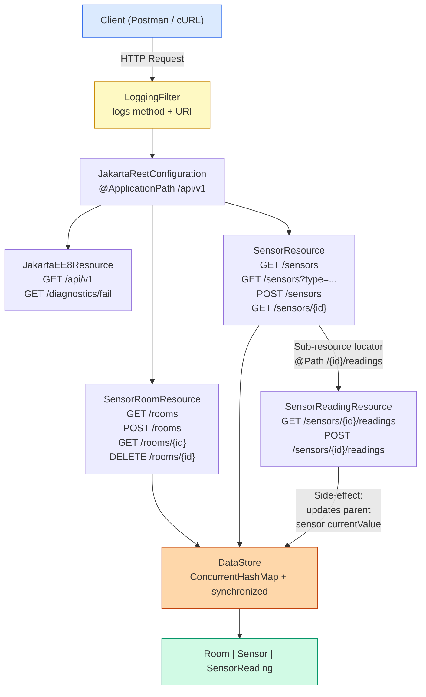
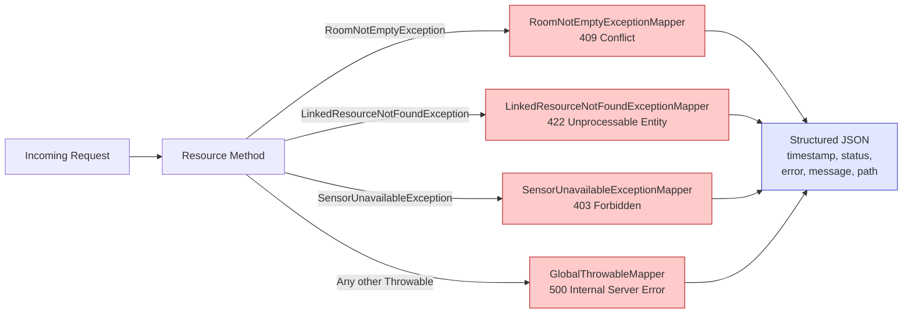
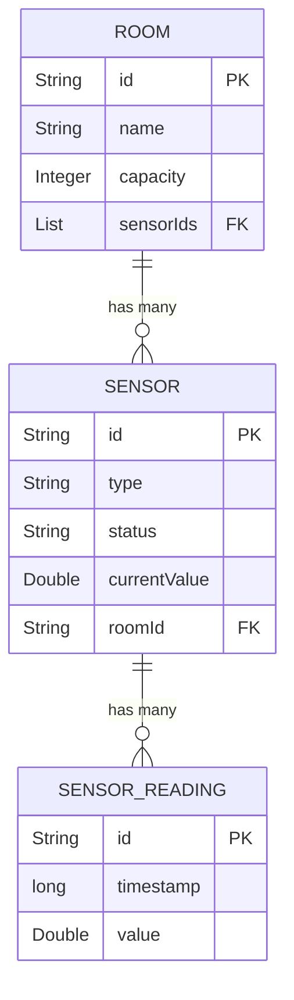

# Smart Campus Room Management API

## Overview

This is my coursework project for the **5COSC022W Client-Server Architectures** module. It is a RESTful API that manages campus rooms, IoT sensors, and historical sensor readings.

The entire project runs without a database. All data lives in-memory using `ConcurrentHashMap` and `CopyOnWriteArrayList` to keep things thread-safe. It is built as a Maven WAR and deployed from NetBeans onto Apache Tomcat.

## How to Build and Run

**What you need installed:**
- Java 8 or higher
- Apache Maven
- NetBeans IDE
- Apache Tomcat

**Steps:**

1. Open NetBeans, go to `File` > `Open Project` and pick the `5COSC022W-Smart-Campus-Project` folder.
2. Make sure Tomcat is added under `Services` > `Servers` in NetBeans.
3. Right-click the project and hit **Clean and Build**. Maven will pull in Jersey and the other dependencies.
4. Right-click the project again and click **Run**. Tomcat starts up and the WAR gets deployed.
5. Once it is running, open Postman or a browser and go to the base URL below.

## Base URL

```
http://localhost:8080/5COSC022W-Smart-Campus-Project/api/v1
```

## Data Model

| Entity | Fields |
|---|---|
| **Room** | `id` (String), `name` (String), `capacity` (Integer), `sensorIds` (List of Strings) |
| **Sensor** | `id` (String), `type` (String), `status` (String), `currentValue` (Double), `roomId` (String) |
| **SensorReading** | `id` (String), `timestamp` (long, epoch millis), `value` (Double) |

## API Request Flow



## Error Handling Pipeline



## Entity Relationships



| Method | Path | What it does |
|---|---|---|
| `GET` | `/api/v1` | Discovery endpoint with version info, contact, and resource links |
| `GET` | `/api/v1/rooms` | Lists all rooms |
| `POST` | `/api/v1/rooms` | Creates a room (returns 201 with Location header) |
| `GET` | `/api/v1/rooms/{id}` | Gets one room by its ID |
| `DELETE` | `/api/v1/rooms/{id}` | Deletes a room (blocks with 409 if it has sensors) |
| `GET` | `/api/v1/sensors` | Lists all sensors |
| `GET` | `/api/v1/sensors?type=temperature` | Filters sensors by type using a query parameter |
| `POST` | `/api/v1/sensors` | Creates a sensor (validates that roomId exists first) |
| `GET` | `/api/v1/sensors/{id}` | Gets one sensor by its ID |
| `GET` | `/api/v1/sensors/{id}/readings` | Gets the reading history for a sensor (sub-resource) |
| `POST` | `/api/v1/sensors/{id}/readings` | Posts a new reading and updates the parent sensor's currentValue |
| `GET` | `/api/v1/diagnostics/fail` | Intentionally throws an error to test the global 500 mapper |

## Error Handling

Every error returns a structured JSON object. No raw stack traces or server error pages ever leak out.

```json
{
  "timestamp": "2026-04-22T12:34:56Z",
  "status": 422,
  "error": "Unprocessable Entity",
  "message": "roomId DOES-NOT-EXIST does not reference an existing room.",
  "path": "/5COSC022W-Smart-Campus-Project/api/v1/sensors"
}
```

| Code | Exception | When it happens |
|---|---|---|
| 409 Conflict | `RoomNotEmptyException` | Trying to delete a room that still has sensors |
| 422 Unprocessable Entity | `LinkedResourceNotFoundException` | Request body references something that does not exist |
| 403 Forbidden | `SensorUnavailableException` | Posting a reading to a sensor in maintenance or offline |
| 500 Internal Server Error | `GlobalThrowableMapper` | Any unhandled exception (catch-all safety net) |

## Project Structure

```
5COSC022W-Smart-Campus-Project/
    pom.xml
    src/main/java/.../project/
        JakartaRestConfiguration.java       @ApplicationPath("/api/v1")
        db/
            DataStore.java                  Thread-safe in-memory store
        models/
            Room.java
            Sensor.java
            SensorReading.java
        resources/
            JakartaEE8Resource.java         Discovery + diagnostics endpoint
            SensorRoomResource.java         Room CRUD
            SensorResource.java             Sensor CRUD + sub-resource locator
            SensorReadingResource.java      Readings sub-resource (GET/POST)
        errors/
            ApiError.java                   Structured JSON error body
            LinkedResourceNotFoundException.java
            RoomNotEmptyException.java
            SensorUnavailableException.java
            mappers/
                LinkedResourceNotFoundExceptionMapper.java    422
                RoomNotEmptyExceptionMapper.java              409
                SensorUnavailableExceptionMapper.java         403
                GlobalThrowableMapper.java                    500
        filters/
            LoggingFilter.java              Request/Response logging
```

---

## Report Answers

Below are my answers to the report questions from the coursework specification.

### 1.1 - JAX-RS Lifecycle and Synchronisation

By default, JAX-RS resource classes are request-scoped. This means the container creates a brand new instance of each resource class for every incoming HTTP request, and throws it away once the response is sent. The benefit of this is that each request handler runs in isolation and there is no risk of one thread accidentally corrupting another thread's local variables.

The challenge this creates is around shared data. Because I am not using an external database, the in-memory data collections need to live outside of the resource classes in a shared location. I placed them as `static` fields inside a `DataStore` utility class. Every request-scoped resource instance accesses the same static maps.

To prevent race conditions, I chose `ConcurrentHashMap` for the room and sensor maps and `CopyOnWriteArrayList` for the sensor ID lists inside each room. These collections handle simple read and write operations safely on their own. However, for compound operations that involve multiple steps (for example, creating a new sensor and then adding its ID to the parent room's sensor list), I wrapped the logic in `synchronized` blocks. This ensures that another thread cannot observe a half-finished state where the sensor exists but the room's list has not been updated yet. I also used `AtomicLong` for generating unique IDs without needing additional synchronisation.

### 1.2 - Discovery Endpoint and HATEOAS

The discovery endpoint at `GET /api/v1` returns a JSON object containing the service name, API version ("v1"), server status, a contact object, and a complete map of all available resource URIs.

This design follows the principle of HATEOAS (Hypermedia as the Engine of Application State). The idea is that a client should be able to discover the entire API starting from a single root URL, without needing to read external documentation or hardcode paths into their application.

The practical benefit is decoupling. If I decide to rename `/rooms` to `/spaces` in a future version, a well-written client that reads the discovery response would pick up the change automatically. The API essentially documents itself at runtime, which is more reliable than maintaining a separate document that can fall out of sync with the actual implementation.

### 2.1 - Room Implementation and POST Return Strategy

When a room is created via `POST /rooms`, the API returns the full room object in the response body (including the server-generated ID and the initialised empty sensor list). The response also includes a `201 Created` status and a `Location` header pointing to the new resource.

The alternative would be to return just the ID and let the client make a second GET request to fetch the complete object. I chose the full-object approach because it eliminates that extra round-trip. In a typical workflow, the client creates a room and then immediately needs to display it. If I only returned the ID, every single creation would require two HTTP calls instead of one. The small increase in response size (a few extra bytes for the name and capacity fields) is a worthwhile trade-off for cutting the number of network requests in half.

### 2.2 - Deletion and Idempotency

`DELETE /rooms/{id}` removes a room from the data store. Before deleting, the API checks whether the room still has sensors attached to it. If it does, the request is rejected with a `409 Conflict` response to prevent orphaned sensor records.

The DELETE operation is fully idempotent. Whether a client sends the request once, twice, or ten times for the same room ID, the observable state of the server is identical after each call: the room does not exist. I return `204 No Content` for both a successful deletion and for cases where the room was already gone (or never existed). This means clients can safely retry on network timeouts without worrying about side effects or needing special logic to distinguish "deleted now" from "was already deleted."

### 3.1 - Sensor Integrity and Content-Type Enforcement

When a new sensor is registered via `POST /sensors`, the API validates that the `roomId` in the request body actually references an existing room. If it does not, the API throws a `LinkedResourceNotFoundException`, which gets mapped to `422 Unprocessable Entity`. This prevents sensors from being created with dangling references to rooms that do not exist.

The `@Consumes(MediaType.APPLICATION_JSON)` annotation on the POST method tells the JAX-RS framework that this endpoint only accepts JSON request bodies. If a client accidentally sends a request with `Content-Type: text/plain` or `application/xml`, the framework intercepts it before my code ever runs and returns a `415 Unsupported Media Type` error automatically. This is handled entirely at the container level, so I do not need to write any manual content-type checking logic inside my methods.

### 3.2 - Filtered Retrieval: QueryParams vs PathParams

The `GET /sensors` endpoint accepts an optional `@QueryParam("type")` parameter. When provided (e.g., `?type=temperature`), the response only includes sensors of that type. When omitted, all sensors are returned.

Path parameters are meant to identify a specific resource in a hierarchy. For example, `/rooms/ROOM-1` means "the room with ID ROOM-1." The path defines identity. Query parameters, on the other hand, are meant for optional modifiers on a collection. Filtering sensors by type does not change what resource you are accessing (it is still the sensors collection), it just narrows down the results. Query strings are also inherently optional, so omitting the parameter simply returns the unfiltered list. They also scale better if you want to add more filters later (e.g., `?type=temperature&status=active`), whereas embedding every filter in the URL path would create an impractical and confusing structure.

### 4.1 - Sub-Resource Locator Architecture

The `/sensors/{id}/readings` endpoint uses the sub-resource locator pattern. In `SensorResource`, the method annotated with `@Path("/{id}/readings")` has no HTTP method annotation (`@GET`, `@POST`, etc.). Instead, it returns a new instance of `SensorReadingResource`, which is a separate class that handles all reading-related operations.

This pattern is about managing complexity. Without it, every reading endpoint (GET the history, POST a new reading, and any future ones like DELETE a specific reading) would live inside the `SensorResource` class, which already handles sensor CRUD. By delegating to a separate class, each file stays focused on a single responsibility. The `SensorResource` deals with sensors, and `SensorReadingResource` deals with readings. This makes the code easier to navigate, easier to test individually, and easier to extend later without bloating an existing class.

### 4.2 - Historical Reading Management

`SensorReadingResource` supports two operations:

- `GET` returns the full reading history for a sensor, sorted by timestamp.
- `POST` records a new reading with an auto-generated UUID, the current timestamp (as epoch milliseconds), and the submitted value.

When a new reading is posted, the API also updates the parent sensor's `currentValue` field to match the new reading. This side-effect is handled inside `DataStore.createReading()` within a `synchronized` block, so the reading insertion and the parent update happen atomically. A concurrent `GET /sensors/{id}` will never return a sensor whose `currentValue` is out of sync with its most recent reading.

### 5.1 - Exception Mapping: Why 422 Instead of 404

I created three custom exception classes, each with a dedicated `ExceptionMapper`:

- `RoomNotEmptyExceptionMapper` returns 409 Conflict when trying to delete a room with sensors.
- `LinkedResourceNotFoundExceptionMapper` returns 422 Unprocessable Entity when a payload references a non-existent resource.
- `SensorUnavailableExceptionMapper` returns 403 Forbidden when posting a reading to a maintenance/offline sensor.

When a client sends `POST /sensors` with a `roomId` that does not exist, returning `404 Not Found` would be misleading. A 404 means the URL endpoint itself could not be resolved. In this case, `POST /sensors` is a perfectly valid endpoint and the server understood the request just fine. The problem is that the JSON body contains a reference to a room that is not in the database. That is a semantic validation error in the payload, not a routing error. HTTP 422 (Unprocessable Entity) is designed for exactly this situation: the server understood the request format but cannot process the instructions because they violate a business rule.

### 5.2 - Global Safety Net and Cybersecurity

The `GlobalThrowableMapper` class implements `ExceptionMapper<Throwable>`, which makes it a catch-all for any exception that is not handled by the three specific mappers above. It converts every unhandled error into a clean `500 Internal Server Error` JSON response with a generic message like "An unexpected server error occurred."

Without this mapper, the application server would return its default error page, which typically includes the full Java stack trace. This is a serious security risk because stack traces reveal:

- Internal file paths and package structure (e.g., `com.ramirucompany.cosc022w.smart.campus.project...`), giving an attacker a map of the codebase.
- Framework and library versions (e.g., Jersey 2.41, Tomcat 10.x), which lets an attacker search for known vulnerabilities (CVEs) in those exact versions.
- The specific lines of code where the failure occurred, providing insight into control flow and potential logic weaknesses.

By catching everything at the API boundary, I make sure no internal implementation detail ever reaches an external consumer.

### 5.3 - Logging Filter (Bonus)

I also implemented a `LoggingFilter` class that acts as both a `ContainerRequestFilter` and a `ContainerResponseFilter`. It logs every incoming HTTP method and URI, and every outgoing response status code.

The advantage of using JAX-RS filters for cross-cutting concerns like logging is centralisation. If I placed `Logger.info()` calls inside every resource method manually, the business logic would be cluttered with boilerplate. Worse, if someone added a new endpoint and forgot the logging call, that route would be invisible in the logs. With a filter registered via `@Provider`, the logging is applied universally by the framework and no endpoint can slip through.

---

## Quick Testing with cURL

**Discovery:**
```bash
curl -i http://localhost:8080/5COSC022W-Smart-Campus-Project/api/v1
```

**Create a room:**
```bash
curl -i -X POST http://localhost:8080/5COSC022W-Smart-Campus-Project/api/v1/rooms \
  -H "Content-Type: application/json" \
  -d '{"name":"Lab A","capacity":30}'
```

**Create a sensor (use the room ID from the previous response):**
```bash
curl -i -X POST http://localhost:8080/5COSC022W-Smart-Campus-Project/api/v1/sensors \
  -H "Content-Type: application/json" \
  -d '{"type":"temperature","status":"active","roomId":"ROOM-1","currentValue":22.5}'
```

**Post a reading (use the sensor ID from the previous response):**
```bash
curl -i -X POST http://localhost:8080/5COSC022W-Smart-Campus-Project/api/v1/sensors/SENSOR-1/readings \
  -H "Content-Type: application/json" \
  -d '{"value":23.1}'
```
