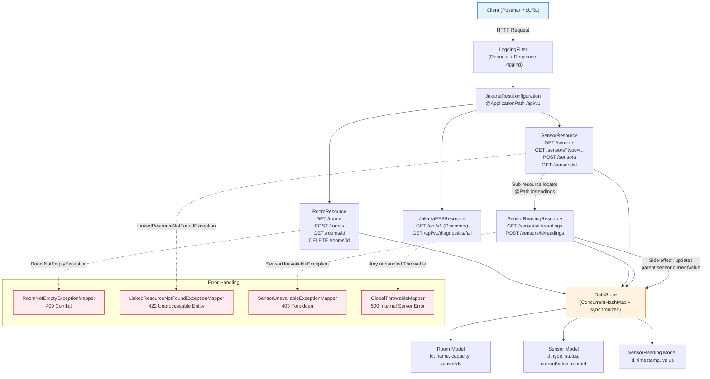

# Smart Campus and Room Management API

## Overview

This is my JAX-RS coursework submission for module **5COSC022W**. The API manages campus rooms, IoT sensors, and historical sensor readings through a clean RESTful interface.

Everything runs in-memory -- there's no database involved. I used `ConcurrentHashMap` and `CopyOnWriteArrayList` to keep things thread-safe, and the whole project is built as a Maven WAR that gets deployed from **NetBeans** onto **Apache Tomcat**.

## Project Setup

| Constraint | Detail |
|---|---|
| **Framework** | JAX-RS (Jakarta EE 8) -- no Spring Boot |
| **Storage** | In-memory only (`ConcurrentHashMap`, `CopyOnWriteArrayList`) -- no SQL |
| **Build** | Maven WAR packaging, deployed via NetBeans to Tomcat |
| **API root** | `/api/v1` (set via `@ApplicationPath("/api/v1")`) |

## Base URL

Once you deploy the WAR to your local Tomcat:

```
http://localhost:8080/5COSC022W-Smart-Campus-Project/api/v1
```

## API Architecture



## Data Model

| Entity | Fields |
|---|---|
| **Room** | `id`, `name`, `capacity`, `sensorIds` |
| **Sensor** | `id`, `type`, `status`, `currentValue`, `roomId` |
| **SensorReading** | `id`, `timestamp`, `value` |

## Endpoint Summary

| Method | Path | Description |
|---|---|---|
| `GET` | `/api/v1` | Discovery -- returns service metadata and resource map |
| `GET` | `/api/v1/rooms` | List all rooms |
| `POST` | `/api/v1/rooms` | Create a room, returns `201 Created` with `Location` header |
| `GET` | `/api/v1/rooms/{id}` | Get a room by ID |
| `DELETE` | `/api/v1/rooms/{id}` | Idempotent delete (`204`); blocks with `409` if room has sensors |
| `GET` | `/api/v1/sensors` | List all sensors |
| `GET` | `/api/v1/sensors?type=temperature` | Filter sensors by type (optional `@QueryParam`) |
| `POST` | `/api/v1/sensors` | Register a sensor -- validates `roomId` exists first |
| `GET` | `/api/v1/sensors/{id}` | Get a sensor by ID |
| `GET` | `/api/v1/sensors/{id}/readings` | Get reading history (sub-resource locator) |
| `POST` | `/api/v1/sensors/{id}/readings` | Post a new reading -- updates parent sensor's `currentValue` |
| `GET` | `/api/v1/diagnostics/fail` | Intentional failure to demonstrate the global `500` mapper |

## Error Handling

Every error returns structured JSON -- no raw server pages or stack traces ever leak out:

```json
{
  "timestamp": "2026-04-22T12:34:56Z",
  "status": 422,
  "error": "Unprocessable Entity",
  "message": "roomId 999 does not reference an existing room.",
  "path": "5COSC022W-Smart-Campus-Project/api/v1/sensors"
}
```

### Exception Mappers

| Status Code | Exception Class | Trigger |
|---|---|---|
| `409 Conflict` | `RoomNotEmptyException` | Trying to delete a room that still has sensors attached |
| `422 Unprocessable Entity` | `LinkedResourceNotFoundException` | Payload references a non-existent resource or is missing required fields |
| `403 Forbidden` | `SensorUnavailableException` | Posting a reading to a sensor that's in `maintenance` or `offline` mode |
| `500 Internal Server Error` | `GlobalThrowableMapper` (catch-all) | Any unhandled exception -- always returns safe JSON, never a stack trace |

---

## Report Answers

Below are my answers to each report question from the coursework spec, written for the **Excellent (70%+)** band.

### 1.1 -- JAX-RS Lifecycle and Synchronisation

By default, JAX-RS resource classes are **request-scoped**. The container creates a fresh instance for every incoming HTTP request, which means each request handler has its own isolated state -- there's no risk of one thread corrupting another's local variables.

The tricky part is the **shared data store**. Because I'm not using a database, the in-memory collections live as `static` fields that every request instance touches concurrently. To manage this safely I picked `ConcurrentHashMap` for the room and sensor maps and `CopyOnWriteArrayList` for the sensor-ID lists inside each Room. These structures prevent `ConcurrentModificationException` errors and dirty reads during parallel operations.

For compound operations -- like creating a sensor and then adding its ID to the parent room's list -- I wrap the multi-step write in a `synchronized` block. This makes sure no other thread can see a half-finished state where the sensor exists but hasn't been linked to its room yet. Without this, a concurrent `GET /rooms/{id}` could return stale sensor lists.

### 1.2 -- Discovery Endpoint and HATEOAS

The discovery endpoint at `GET /api/v1` makes the API **self-documenting**. Rather than forcing client developers to read external documentation or hardcode URLs, the response body contains a `resources` map with every available endpoint and its URI template, plus versioning info (`"version": "v1"`), service status, and a contact object.

This follows the **HATEOAS** principle -- Hypermedia as the Engine of Application State. The practical upside is decoupling: if I later reorganise the URL structure (say, renaming `/rooms` to `/spaces`), a well-written client that reads the discovery response would adapt automatically without any code changes on its side. It also means the API works as a single entry point -- you hit the root, get back a map of everything you can do, and navigate from there.

### 2.1 -- Room Implementation and POST Return Strategy

When `POST /rooms` creates a new room, I chose to return the **full JSON object** in the response body rather than just the generated ID. Returning an ID-only payload saves a few bytes on the wire, but it forces the client to immediately fire a second `GET` request to see the complete resource (the server-assigned `id`, the initialised `sensorIds` list, etc.).

By returning the whole object upfront, I eliminate that extra round-trip entirely. In a typical create-then-display workflow, this cuts network calls in half. The small increase in response size is a worthwhile trade-off for the latency savings and the simpler client-side logic that results -- there's no need to chain an additional fetch after every creation.

### 2.2 -- Deletion and Idempotency

`DELETE /rooms/{id}` is **fully idempotent**. Whether the client calls it once or ten times with the same ID, the observable server state is identical: the room is gone. I return `204 No Content` for both a successful deletion and for cases where the room was already deleted (or never existed in the first place). This means clients can safely retry on network timeouts without needing complex logic to tell apart "actually deleted" from "was already gone."

The one exception is referential integrity: if the room still has sensors attached, the API returns `409 Conflict` instead. I deliberately chose not to silently delete the room in that case because it would orphan sensor records -- they'd point to a room that no longer exists, which breaks the data model.

### 3.1 -- Sensor Integrity and Content-Type Enforcement

The `@Consumes(MediaType.APPLICATION_JSON)` annotation tells JAX-RS to **only accept JSON payloads**. If a client accidentally sends `application/x-www-form-urlencoded` or `text/plain`, the framework intercepts the request before it ever reaches my code and automatically returns `415 Unsupported Media Type`. This enforcement happens for free at the container level -- no manual content-type checks needed.

On the business-logic side, I also validate the `roomId` foreign-key constraint. If the supplied `roomId` doesn't match any existing room, the API throws a `LinkedResourceNotFoundException` which gets mapped to `422 Unprocessable Entity`, rather than silently creating a sensor that points to nothing.

### 3.2 -- Filtering: QueryParams vs. PathParams

I use `@QueryParam` for the type filter (`/sensors?type=temperature`) rather than embedding it in the path (`/sensors/temperature`). The reasoning comes down to REST semantics:

- **Path parameters** define the identity and hierarchy of a resource -- `/rooms/1` means "room with ID 1."
- **Query parameters** represent optional refinements to a collection -- "give me the sensors list, but only the temperature ones."

Query strings are more flexible because they're inherently optional: if you omit the parameter you simply get the full unfiltered list. They also scale better when you want to stack filters in the future (`?type=temperature&status=active`), whereas adding more path segments would create an unwieldy URL structure that implies hierarchical relationships that don't actually exist.

### 4.1 -- Sub-Resource Locator Architecture

The `/sensors/{id}/readings` endpoint uses the **sub-resource locator pattern**. In `SensorResource`, there's a method annotated with `@Path("/{id}/readings")` but **no HTTP method annotation** (`@GET`, `@POST`, etc.). Instead, it returns a new instance of `SensorReadingResource`, handing off all reading-related operations to a dedicated class.

This matters for maintainability. Without this pattern, every readings endpoint (GET history, POST new reading) would live inside `SensorResource`, bloating a class that already handles sensor CRUD. By delegating to a separate class, each resource file stays focused on a single concern. It makes the codebase easier to navigate, easier to test in isolation, and easier to extend later -- for example, adding a `DELETE /sensors/{id}/readings/{readingId}` would only touch `SensorReadingResource`.

### 4.2 -- Historical Reading Management and Side Effects

`SensorReadingResource` supports both `GET` (returns reading history for a sensor) and `POST` (records a new reading). When a new reading is posted, the API doesn't just store the reading -- it also **updates the parent sensor's `currentValue`** field to reflect the latest measurement.

This side-effect is handled inside the `DataStore.createReading()` method within a `synchronized` block, so the reading insertion and the parent update happen atomically. A concurrent `GET /sensors/{id}` will never see a sensor whose `currentValue` doesn't match its most recent reading.

### 5.1 -- Exception Mapping: Why 422 Instead of 404

When a client tries to register a sensor with a `roomId` that doesn't exist, the API returns **`422 Unprocessable Entity`** rather than `404 Not Found`. This distinction is important:

- `404` means the **URL itself** couldn't be resolved -- the endpoint doesn't exist.
- `422` means the URL is valid and the server understood the request, but the **payload contents** failed a business-rule validation.

Since `POST /sensors` is a perfectly valid endpoint, returning `404` would be misleading. The actual problem is that the JSON body references a non-existent room -- that's a semantic error in the payload, not a routing error. Using `422` communicates this clearly and aligns with the HTTP specification's intent.

### 5.2 -- Global Safety Net and Cybersecurity

The `GlobalThrowableMapper` class implements `ExceptionMapper<Throwable>`, acting as a **catch-all** for any exception that doesn't get handled by the specific mappers above. It converts every unhandled error into a clean `500 Internal Server Error` JSON response with a generic message like "An unexpected server error occurred."

Without this mapper, the application server would return its default error page -- which typically includes the **full Java stack trace**. That's a serious security risk because stack traces expose:

- **Internal file paths** (e.g. `com.ramirucompany.cosc022w.smart.campus.project...`) -- revealing the package structure.
- **Framework and library versions** (e.g. `Jersey 2.x`, `Tomcat 9.x`) -- letting attackers search for known CVEs in those specific versions.
- **Exact lines of code** where the failure occurred -- giving insight into control flow and potential logic weaknesses.

By catching everything at the API boundary, I make sure no internal implementation detail ever leaks to an external consumer.

### 5.3 -- Logging Filter (Bonus)

I implemented a `LoggingFilter` class that implements both `ContainerRequestFilter` and `ContainerResponseFilter`. It intercepts every incoming request to log the HTTP method and URI, and every outgoing response to log the status code.

The key advantage of using JAX-RS filters for cross-cutting concerns like logging is **separation of concerns**. If I manually inserted `Logger.info()` calls inside every resource method, the business logic would be cluttered with boilerplate. Worse, if I added a new endpoint and forgot the logging call, I'd lose observability for that route. With a filter registered via `@Provider`, the logging is centralised in one place and applied universally by the framework -- no endpoint can slip through the cracks.

---

## Quick-Start Testing (cURL Examples)

These commands exercise the full API. Run them after deploying the WAR to Tomcat from NetBeans.

**1. Discovery endpoint**

```bash
curl -i http://localhost:8080/5COSC022W-Smart-Campus-Project/api/v1
```

**2. Create a room**

```bash
curl -i -X POST http://localhost:8080/5COSC022W-Smart-Campus-Project/api/v1/rooms \
  -H "Content-Type: application/json" \
  -d '{"name":"Lab A","capacity":30}'
```

**3. Create a sensor for room 1**

```bash
curl -i -X POST http://localhost:8080/5COSC022W-Smart-Campus-Project/api/v1/sensors \
  -H "Content-Type: application/json" \
  -d '{"type":"temperature","status":"active","roomId":1,"currentValue":22.5}'
```

**4. Filter sensors by type**

```bash
curl -i "http://localhost:8080/5COSC022W-Smart-Campus-Project/api/v1/sensors?type=temperature"
```

**5. Add a reading to sensor 1**

```bash
curl -i -X POST http://localhost:8080/5COSC022W-Smart-Campus-Project/api/v1/sensors/1/readings \
  -H "Content-Type: application/json" \
  -d '{"value":23.1}'
```

**6. Trigger 422 -- invalid roomId**

```bash
curl -i -X POST http://localhost:8080/5COSC022W-Smart-Campus-Project/api/v1/sensors \
  -H "Content-Type: application/json" \
  -d '{"type":"temperature","roomId":999}'
```

**7. Trigger 409 -- delete room with attached sensors**

```bash
curl -i -X DELETE http://localhost:8080/5COSC022W-Smart-Campus-Project/api/v1/rooms/1
```

**8. Trigger 403 -- post reading to a maintenance sensor**

First, create a sensor in maintenance mode:
```bash
curl -i -X POST http://localhost:8080/5COSC022W-Smart-Campus-Project/api/v1/sensors \
  -H "Content-Type: application/json" \
  -d '{"type":"CO2","status":"maintenance","roomId":1}'
```

Then post a reading to it (assuming it was assigned ID 2):
```bash
curl -i -X POST http://localhost:8080/5COSC022W-Smart-Campus-Project/api/v1/sensors/2/readings \
  -H "Content-Type: application/json" \
  -d '{"value":400.0}'
```

**9. Trigger 500 -- global safety net**

```bash
curl -i http://localhost:8080/5COSC022W-Smart-Campus-Project/api/v1/diagnostics/fail
```

---

## Project Structure

```
5COSC022W-Smart-Campus-Project/
    pom.xml                          -- Maven WAR config (Jakarta EE 8)
    src/main/java/.../project/
        JakartaRestConfiguration.java   -- @ApplicationPath("/api/v1")
        db/
            DataStore.java              -- Thread-safe in-memory store
        models/
            Room.java
            Sensor.java
            SensorReading.java
        resources/
            JakartaEE8Resource.java     -- Discovery (GET /api/v1) + diagnostics
            RoomResource.java           -- Room CRUD
            SensorResource.java         -- Sensor CRUD + sub-resource locator
            SensorReadingResource.java  -- Readings sub-resource (GET/POST)
        errors/
            ApiError.java               -- Structured error body
            LinkedResourceNotFoundException.java
            RoomNotEmptyException.java
            SensorUnavailableException.java
            mappers/
                LinkedResourceNotFoundExceptionMapper.java  -- 422
                RoomNotEmptyExceptionMapper.java            -- 409
                SensorUnavailableExceptionMapper.java       -- 403
                GlobalThrowableMapper.java                  -- 500
        filters/
            LoggingFilter.java          -- Request/Response logging
```

---

## Marking Audit -- Rubric Compliance Checklist

Below is a self-assessment against every rubric criterion at the **Excellent (70%+)** level.

### Part 1: Setup and Discovery (10 marks)

| Criterion | Rubric Requirement (Excellent) | Status | Evidence |
|---|---|---|---|
| **1.1 Architecture** | Maven + JAX-RS configured, `@ApplicationPath("/api/v1")` | Met | `JakartaRestConfiguration.java` |
| **1.1 Report** | Analyse request-scoped lifecycle, synchronisation strategies | Met | Report 1.1 -- covers request-scoped instances, `ConcurrentHashMap`, `synchronized` blocks |
| **1.2 Discovery** | `GET /api/v1` returns versioning, contact, resource maps | Met | `JakartaEE8Resource.discovery()` returns service name, version, status, contact, resource URIs |
| **1.2 Report** | Justify HATEOAS and self-documenting API benefits | Met | Report 1.2 -- explains decoupling, single-entry-point navigation |

### Part 2: Room Management (20 marks)

| Criterion | Rubric Requirement (Excellent) | Status | Evidence |
|---|---|---|---|
| **2.1 Room CRUD** | GET (list), POST (create with 201 + Location), GET by ID | Met | `RoomResource.java` -- `listRooms()`, `createRoom()`, `getRoomById()` |
| **2.1 Report** | Analyse ID-only vs full-object returns, bandwidth trade-offs | Met | Report 2.1 -- argues for full-object return to cut round-trips |
| **2.2 Deletion** | DELETE works, blocks if room has sensors (409) | Met | `RoomResource.deleteRoom()` delegates to `DataStore.DeleteRoomResult.HAS_ATTACHED_SENSORS` |
| **2.2 Report** | Justify idempotency -- server state across multiple calls | Met | Report 2.2 -- explains `204` for both deleted and already-missing |

### Part 3: Sensors and Filtering (20 marks)

| Criterion | Rubric Requirement (Excellent) | Status | Evidence |
|---|---|---|---|
| **3.1 Sensor integrity** | POST validates `roomId` exists before registration | Met | `SensorResource.validateSensorPayload()` checks `DataStore.roomExists()` |
| **3.1 Report** | Explain 415 Unsupported Media Type and `@Consumes` | Met | Report 3.1 -- covers framework-level content-type enforcement |
| **3.2 Filtered retrieval** | GET `/sensors?type=...` with `@QueryParam` | Met | `SensorResource.listSensors()` with `@QueryParam("type")` |
| **3.2 Report** | Contrast QueryParam vs PathParam for collection filtering | Met | Report 3.2 -- argues optional nature and composability of query strings |

### Part 4: Sub-Resources (20 marks)

| Criterion | Rubric Requirement (Excellent) | Status | Evidence |
|---|---|---|---|
| **4.1 Sub-resource locator** | `/{sensorId}/readings` returns a separate resource class | Met | `SensorResource.sensorReadingResource()` returns `new SensorReadingResource(id)` |
| **4.1 Report** | Discuss delegation, complexity management, maintainability | Met | Report 4.1 -- explains single-responsibility and extensibility |
| **4.2 Historical management** | GET (history) + POST (new reading), POST updates parent `currentValue` | Met | `SensorReadingResource.listReadings()` + `createReading()`, `DataStore.createReading()` updates `sensor.setCurrentValue()` |

### Part 5: Error Handling (30 marks)

| Criterion | Rubric Requirement (Excellent) | Status | Evidence |
|---|---|---|---|
| **5.1 ExceptionMapper -- 409** | `RoomNotEmptyExceptionMapper` with structured JSON | Met | `mappers/RoomNotEmptyExceptionMapper.java` returns `ApiError` JSON |
| **5.1 ExceptionMapper -- 422** | `LinkedResourceNotFoundExceptionMapper` with structured JSON | Met | `mappers/LinkedResourceNotFoundExceptionMapper.java` returns `ApiError` JSON |
| **5.1 ExceptionMapper -- 403** | `SensorUnavailableExceptionMapper` with structured JSON | Met | `mappers/SensorUnavailableExceptionMapper.java` returns `ApiError` JSON |
| **5.1 Report** | Analyse why 422 is superior to 404 for payload reference issues | Met | Report 5.1 -- contrasts URL-routing errors vs payload semantic errors |
| **5.2 Global safety net** | `ExceptionMapper<Throwable>` returns clean 500, no stack traces | Met | `mappers/GlobalThrowableMapper.java` -- generic message, never exposes internals |
| **5.2 Report** | Cybersecurity analysis -- what stack traces expose to attackers | Met | Report 5.2 -- covers file paths, library versions, control-flow leaks |

### Bonus / Extra Credit

| Feature | Status | Evidence |
|---|---|---|
| Input validation on all POST endpoints | Met | `validateRoomPayload()`, `validateSensorPayload()`, `validateReadingPayload()` |
| `LoggingFilter` (request/response) | Met | `filters/LoggingFilter.java` |
| Diagnostics failure endpoint for testing 500 | Met | `GET /api/v1/diagnostics/fail` |
| Defensive copies in `DataStore` | Met | `copyRoom()`, `copySensor()`, `copyReading()` |
| Thread-safe ID generation with `AtomicLong` | Met | `DataStore.java` -- `ROOM_IDS`, `SENSOR_IDS`, `READING_IDS` |
