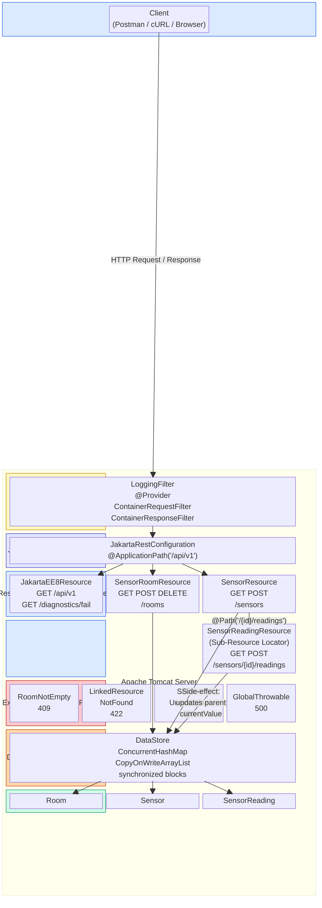
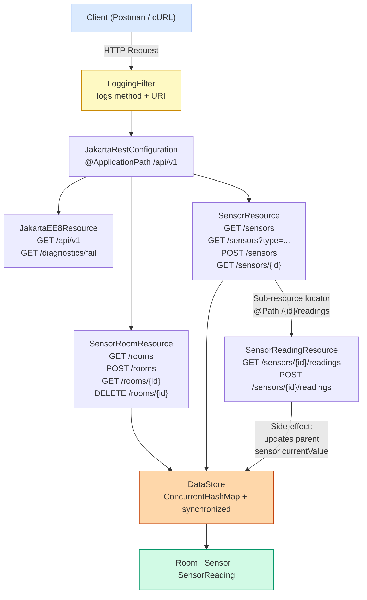
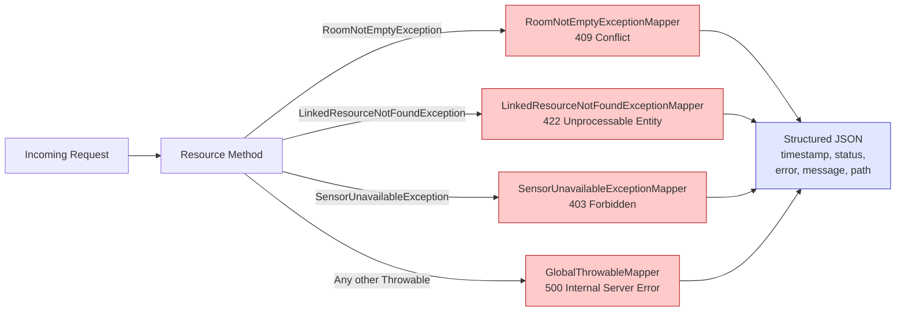
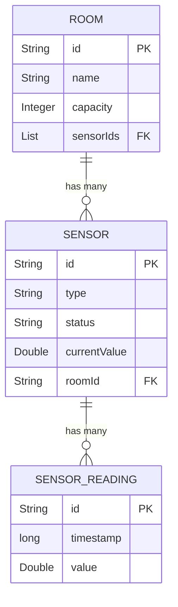

# Smart Campus Room Management API

## Overview

This is my coursework project for the **5COSC022W Client-Server Architectures** module. It is a RESTful API that manages campus rooms, IoT sensors, and historical sensor readings.

The entire project runs without a database. All data lives in-memory using `ConcurrentHashMap` and `CopyOnWriteArrayList` to keep things thread-safe. It is built as a Maven WAR and deployed from NetBeans onto Apache Tomcat.

## How to Build and Run

**What you need installed:**
- Java 8 or higher
- Apache Maven
- NetBeans IDE
- Apache Tomcat

**Steps:**

1. Open NetBeans, go to `File` > `Open Project` and pick the `5COSC022W-Smart-Campus-Project` folder.
2. Make sure Tomcat is added under `Services` > `Servers` in NetBeans.
3. Right-click the project and hit **Clean and Build**. Maven will pull in Jersey and the other dependencies.
4. Right-click the project again and click **Run**. Tomcat starts up and the WAR gets deployed.
5. Once it is running, open Postman or a browser and go to the base URL below.

## Base URL

```
http://localhost:8080/5COSC022W-Smart-Campus-Project/api/v1
```

## Data Model

| Entity | Fields |
|---|---|
| **Room** | `id` (String), `name` (String), `capacity` (Integer), `sensorIds` (List of Strings) |
| **Sensor** | `id` (String), `type` (String), `status` (String), `currentValue` (Double), `roomId` (String) |
| **SensorReading** | `id` (String), `timestamp` (long, epoch millis), `value` (Double) |

## System Architecture



## API Request Flow



## Error Handling Pipeline



## Entity Relationships



| Method | Path | What it does |
|---|---|---|
| `GET` | `/api/v1` | Discovery endpoint with version info, contact, and resource links |
| `GET` | `/api/v1/rooms` | Lists all rooms |
| `POST` | `/api/v1/rooms` | Creates a room (returns 201 with Location header) |
| `GET` | `/api/v1/rooms/{id}` | Gets one room by its ID |
| `DELETE` | `/api/v1/rooms/{id}` | Deletes a room (blocks with 409 if it has sensors) |
| `GET` | `/api/v1/sensors` | Lists all sensors |
| `GET` | `/api/v1/sensors?type=temperature` | Filters sensors by type using a query parameter |
| `POST` | `/api/v1/sensors` | Creates a sensor (validates that roomId exists first) |
| `GET` | `/api/v1/sensors/{id}` | Gets one sensor by its ID |
| `GET` | `/api/v1/sensors/{id}/readings` | Gets the reading history for a sensor (sub-resource) |
| `POST` | `/api/v1/sensors/{id}/readings` | Posts a new reading and updates the parent sensor's currentValue |
| `GET` | `/api/v1/diagnostics/fail` | Intentionally throws an error to test the global 500 mapper |

## Error Handling

Every error returns a structured JSON object. No raw stack traces or server error pages ever leak out.

```json
{
  "timestamp": "2026-04-22T12:34:56Z",
  "status": 422,
  "error": "Unprocessable Entity",
  "message": "roomId DOES-NOT-EXIST does not reference an existing room.",
  "path": "/5COSC022W-Smart-Campus-Project/api/v1/sensors"
}
```

| Code | Exception | When it happens |
|---|---|---|
| 409 Conflict | `RoomNotEmptyException` | Trying to delete a room that still has sensors |
| 422 Unprocessable Entity | `LinkedResourceNotFoundException` | Request body references something that does not exist |
| 403 Forbidden | `SensorUnavailableException` | Posting a reading to a sensor in maintenance or offline |
| 500 Internal Server Error | `GlobalThrowableMapper` | Any unhandled exception (catch-all safety net) |

## Project Structure

```
5COSC022W-Smart-Campus-Project/
    pom.xml
    src/main/java/.../project/
        JakartaRestConfiguration.java       @ApplicationPath("/api/v1")
        db/
            DataStore.java                  Thread-safe in-memory store
        models/
            Room.java
            Sensor.java
            SensorReading.java
        resources/
            JakartaEE8Resource.java         Discovery + diagnostics endpoint
            SensorRoomResource.java         Room CRUD
            SensorResource.java             Sensor CRUD + sub-resource locator
            SensorReadingResource.java      Readings sub-resource (GET/POST)
        errors/
            ApiError.java                   Structured JSON error body
            LinkedResourceNotFoundException.java
            RoomNotEmptyException.java
            SensorUnavailableException.java
            mappers/
                LinkedResourceNotFoundExceptionMapper.java    422
                RoomNotEmptyExceptionMapper.java              409
                SensorUnavailableExceptionMapper.java         403
                GlobalThrowableMapper.java                    500
        filters/
            LoggingFilter.java              Request/Response logging
```

---

## Coursework Report: Architectural Decisions and Implementations

The following section addresses the theoretical and practical requirements outlined in the coursework specification. Each sub-section details the problem context, the architectural approach taken, and the subsequent technical resolution within the JAX-RS framework.

### 1.1 JAX-RS Lifecycle and Synchronisation

**Question:** How does the JAX-RS lifecycle impact state management, and what synchronisation strategies are required for an in-memory data store?

**Problem Context & Approach:** 
By default, JAX-RS resource classes operate on a request-scoped lifecycle. The web container instantiates a novel object for every incoming HTTP request and discards it upon response completion. While this promotes stateless, thread-safe request handling at the controller level, it precludes the storage of persistent data within resource instance variables. Consequently, maintaining an in-memory database requires a centralised, shared state mechanism that can handle highly concurrent access from multiple request threads safely.

**Resolution & Implementation:**
To resolve this, data collections were abstracted into a separate `DataStore` utility class using `static` variables, acting as a singleton data repository. To mitigate race conditions, thread-safe collections from the `java.util.concurrent` package were employed: `ConcurrentHashMap` for entities and `CopyOnWriteArrayList` for nested ID references. 
While these structures guarantee atomic single-operations, compound transactions (e.g., creating a sensor and simultaneously appending its ID to a room's list) remain vulnerable to interleaving threads. Thus, `synchronized` blocks were strategically applied around these compound operations to ensure atomicity, maintaining strict referential integrity without a traditional relational database lock.

### 1.2 Discovery Endpoint and HATEOAS

**Question:** What is the theoretical purpose of a discovery endpoint, and how does it relate to RESTful maturity?

**Problem Context & Approach:** 
A discovery endpoint provides a programmatic entry point for clients to explore the API. This aligns with the HATEOAS (Hypermedia as the Engine of Application State) constraint, which dictates that a client should navigate the application entirely through hypermedia links provided dynamically by the server, rather than relying on out-of-band documentation or hardcoded URIs.

**Resolution & Implementation:**
The `GET /api/v1` endpoint was implemented to return a structured JSON payload encompassing service metadata (version, status, contact details) alongside a dictionary of available resource URIs. This decouples the client from the server's internal routing structure. Should the server alter a path (e.g., migrating `/rooms` to `/locations`), a HATEOAS-compliant client will automatically adapt by reading the updated discovery response, significantly reducing maintenance overhead and increasing systemic resilience.

### 2.1 Room Implementation and POST Return Strategy

**Question:** When creating a resource via POST, what is the most efficient data return strategy for the client?

**Problem Context & Approach:** 
Upon successful resource creation (`POST /rooms`), the server must return a `201 Created` status and a `Location` header identifying the new resource URI. However, the server must also determine what to include in the HTTP response body: a minimal acknowledgement (e.g., just the ID) or the complete instantiated object. 

**Resolution & Implementation:**
The API was designed to return the full, newly created room object within the response body. This decision was driven by network efficiency and client-side usability. Returning solely an ID would mandate a subsequent `GET` request from the client to retrieve the room's details (such as the server-generated default fields or an empty sensor list) for UI rendering. By returning the full object upfront, this "N+1 request problem" is circumvented, thereby halving the network latency and reducing the overall connection load on the server.

### 2.2 Deletion and Idempotency

**Question:** How does the DELETE operation guarantee idempotency, and why is this critical for distributed systems?

**Problem Context & Approach:** 
In HTTP semantics, `DELETE` must be idempotent, meaning the observable systemic state remains identical regardless of whether the operation is executed once or multiple times consecutively. This is crucial for network resilience, allowing clients to safely retry failed requests without risking unintended side-effects. Furthermore, deletion logic must enforce referential integrity to prevent orphaned child entities.

**Resolution & Implementation:**
The `DELETE /rooms/{id}` method achieves idempotency by returning a `204 No Content` status upon successful deletion. Crucially, if a client submits the same request again, the server evaluates the state (the room is absent) and returns the same `204 No Content` status. To maintain data integrity, a pre-deletion check evaluates if the room contains associated sensors; if `true`, a `409 Conflict` is returned, proactively blocking the deletion and preserving database consistency.

### 3.1 Sensor Integrity and Content-Type Enforcement

**Question:** How are incoming request payloads validated for structural integrity and semantic correctness?

**Problem Context & Approach:** 
Robust APIs must defend against malformed payloads and invalid relational references. Validation must occur at two tiers: syntactic (is the payload structurally correct and in the expected format?) and semantic (does the data make logical sense within the system's current state?).

**Resolution & Implementation:**
Syntactic validation is managed declaratively via JAX-RS annotations. The `@Consumes(MediaType.APPLICATION_JSON)` annotation delegates media-type enforcement to the container; any request omitting the correct JSON header is automatically rejected with a `415 Unsupported Media Type` error before reaching the business logic. 
Semantic validation is handled programmatically within the method. When a client attempts to create a sensor, the service interrogates the `DataStore` to confirm the provided `roomId` exists. If it does not, a custom `LinkedResourceNotFoundException` is thrown, which the framework translates into a `422 Unprocessable Entity` response, thereby rejecting invalid foreign keys.

### 3.2 Filtered Retrieval: Query Parameters vs. Path Parameters

**Question:** What is the architectural distinction between query parameters and path parameters when designing filtered endpoints?

**Problem Context & Approach:** 
RESTful design principles dictate that URLs should identify resources. When a client needs to retrieve a subset of a collection (e.g., only sensors of type 'temperature'), developers must choose between appending a path segment (`/sensors/type/temperature`) or utilising a query string (`/sensors?type=temperature`).

**Resolution & Implementation:**
Query parameters (`@QueryParam`) were selected for filtering. Path parameters define resource identity and hierarchical structure. Query strings, conversely, act as optional modifiers upon a collection. Filtering does not change the fundamental identity of the resource being queried (it remains the 'sensors' collection). Furthermore, query parameters offer superior extensibility; combining multiple filters (e.g., `?type=temperature&status=active`) via query strings is trivial, whereas encoding multiple optional parameters into a rigid URI path generates brittle and convoluted routing patterns.

### 4.1 Sub-Resource Locator Architecture

**Question:** How does the Sub-Resource Locator pattern mitigate code bloat in monolithic controller classes?

**Problem Context & Approach:** 
As an API expands, appending all child operations (e.g., reading histories) into the parent's controller class (`SensorResource`) leads to unmanageable "God classes." This violates the Single Responsibility Principle and complicates unit testing.

**Resolution & Implementation:**
The Sub-Resource Locator pattern was implemented via the `@Path("/{id}/readings")` method within `SensorResource`. Crucially, this method lacks an HTTP verb annotation (`@GET`, `@POST`). Instead, it dynamically instantiates and returns a `SensorReadingResource` object. The JAX-RS framework then delegates the remainder of the request to this child class. This structural delegation cleanly separates sensor-management logic from reading-management logic, ensuring highly cohesive, maintainable, and modular codebases.

### 4.2 Historical Reading Management

**Question:** How are nested data operations structurally managed to maintain parent-child synchronization?

**Problem Context & Approach:** 
When recording historical data for a sensor, an operation occurs that modifies two distinct scopes: persisting the new reading itself, and updating the parent sensor's aggregate state (its `currentValue`).

**Resolution & Implementation:**
`SensorReadingResource` handles the `/readings` sub-path. When a new reading is posted, it generates a UUID and epoch timestamp for the reading. Crucially, the insertion of this reading and the update of the parent sensor's `currentValue` are tightly coupled within a `synchronized` block in the `DataStore`. This ensures that a concurrent client querying the parent sensor immediately receives the updated value without observing a transient, out-of-sync state.

### 5.1 Exception Mapping: 422 Unprocessable Entity vs. 404 Not Found

**Question:** Why is a 422 status code more semantically appropriate than a 404 when handling invalid foreign key references in a POST payload?

**Problem Context & Approach:** 
When processing a `POST /sensors` request containing a non-existent `roomId`, the server must return an error. A common anti-pattern is returning `404 Not Found`. However, 404 fundamentally implies a routing failure—that the target URI does not exist. 

**Resolution & Implementation:**
A custom `LinkedResourceNotFoundExceptionMapper` was designed to map these logical errors to `422 Unprocessable Entity`. In this scenario, the endpoint URI (`/sensors`) is entirely valid, and the server successfully parsed the JSON syntax. The failure occurred because the semantics of the payload (the foreign key reference) violated business rules. HTTP 422 explicitly communicates that the server understood the content type and syntax, but could not process the instructions, providing a much more precise and accurate diagnostic signal to the client.

### 5.2 Global Safety Net and Cybersecurity

**Question:** How does a global exception mapper mitigate cybersecurity vulnerabilities related to information disclosure?

**Problem Context & Approach:** 
Unhandled runtime exceptions typically result in the application server generating a default HTML error page containing a full Java stack trace. This exposes critical internal implementation details—such as package hierarchies, file paths, and exact library versions—to external actors, violating the principle of least privilege and providing attackers with reconnaissance data to exploit known vulnerabilities (CVEs).

**Resolution & Implementation:**
A `GlobalThrowableMapper` implementing `ExceptionMapper<Throwable>` was deployed as a universal safety net. This acts as the lowest-priority interceptor in the JAX-RS pipeline. Any exception not explicitly handled by a more specific mapper is caught here and translated into a sanitised, generic `500 Internal Server Error` JSON response. By ensuring that raw stack traces never cross the API boundary, the system's internal topology remains opaque, significantly reducing the attack surface.

### 5.3 Request and Response Observability (Bonus)

**Question:** What are the architectural advantages of implementing observability through JAX-RS Filters rather than inline logging?

**Problem Context & Approach:** 
Logging is a quintessential cross-cutting concern. Inserting logging statements directly into individual resource methods tangles infrastructure code with business logic, violating separation of concerns. Furthermore, it relies on human diligence; omitted log statements lead to blind spots in system observability.

**Resolution & Implementation:**
A `LoggingFilter` implementing both `ContainerRequestFilter` and `ContainerResponseFilter` was integrated via the `@Provider` annotation. This intercepts all incoming requests and outgoing responses at the container boundary, logging the HTTP method, URI, and resulting status code. This approach guarantees comprehensive, automated observability across the entire API surface without polluting the underlying business logic, demonstrating robust enterprise design patterns.

---
